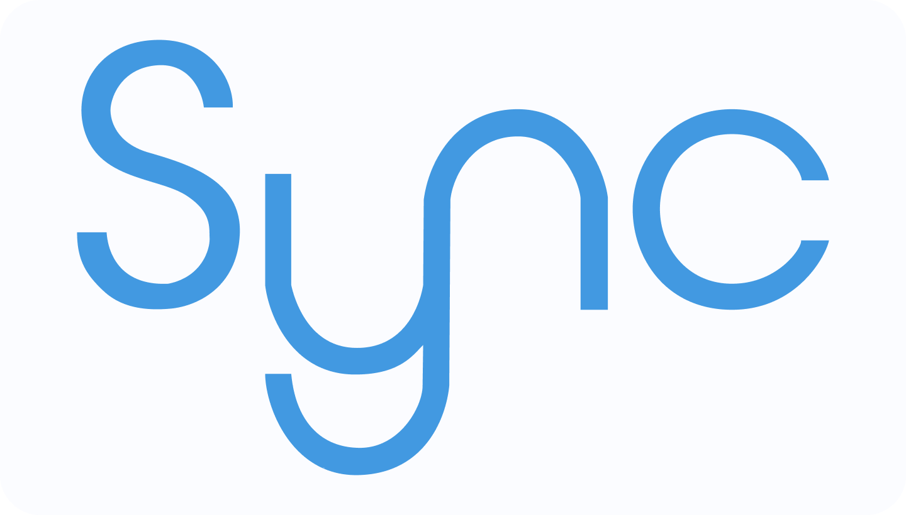

<div align="center" style="margin-bottom: 3rem">
  
</div>

<p align="center">
    <a href="https://github.com/FelippeChemello">
        
    </a> 
    <br/>
    <a href="https://github.com/FelippeChemello/sync.video/actions">
        
    </a>
    <a href="https://github.com/felippechemello/sync.video/deployments">
        
    </a>   
    <a href="sync-video.codestack.me">
        
    </a>      
    <a href="sync-video.codestack.me">
        
    </a>  
</p>

<h1 align="center" style="font-size: 1.7rem">
   Aplicação web para assistir videos de forma remota e sincronizada
</h1>
<h2 align="center" style="font-size: 1.3rem">
   <a href="https://sync-video.codestack.me">https://sync-video.codestack.me</a>
</h2>

## 💻 Tecnologias

<p align="center">
    
    
    
    
    
    
    
</p>

Este projeto foi desenvolvido utilizando [Typescript](https://www.typescriptlang.org/) como linguagem de programação. 
No **backend** foi utilizado [NodeJS](https://nodejs.dev/) juntamente com os frameworks [express](https://expressjs.com/pt-br/) e [socket.io](https://socket.io/) para lidar com requisições HTTP e WebSocket, respectivamente.
No **frontend** foi utilizado [NextJS](https://nextjs.org/).
Como **Banco de Dados** foi utilizado [MySQL](https://www.mysql.com/) e [TypeORM](https://typeorm.io/) como ferramenta de mapeamento objeto-relacional.

## ☕ Instalando o projeto localmente

Para instalr **sync.video**, siga estas etapas:

1. Clone o projeto
    ```bash
    git clone https://github.com/FelippeChemello/sync.video
    ```
2. Acesse o projeto 
   ```bash
   cd sync.video
   ```
3. Instale as dependencias em `web` e `backend`
    ```bash
    cd web && yarn
    ```
    ```bash
    cd backend && yarn
    ```
4. Execute o `frontend` e `backend` em desenvolvimento
    ```bash
    cd web && yarn dev
    ```
    ```bash
    cd backend && yarn dev 
    ```
    > O comando `yarn dev` no backend já irá subir uma instancia de mysql em `docker`. <br />    Certifique-se de ter `docker` instalado em seu computador

## 📫 Contribuições

Para contribuir com **sync.video**, siga estas etapas:

1. Faça um fork deste repositório.
2. Crie um branch com o nome de sua funcionalidade `git checkout -b <nome_funcionalidade>`.
3. Faça suas alterações e confirme-as: `git commit -m '<mensagem_commit>'`
4. Envie para o branch original: `git push origin <nome_do_projeto> / <local>`
5. Crie a solicitação de pull.


## 📝 Licença

Este projeto está licenciado sobre MIT - verifique o arquivo [LICENSE](LICENSE) para detalhes.

---

Desenvolvido como Trabalho de Conclusão de Curso da Faculdade de Ciência da Computação da UniRitter (2021/2) por Felippe Jaqson Chemello.
